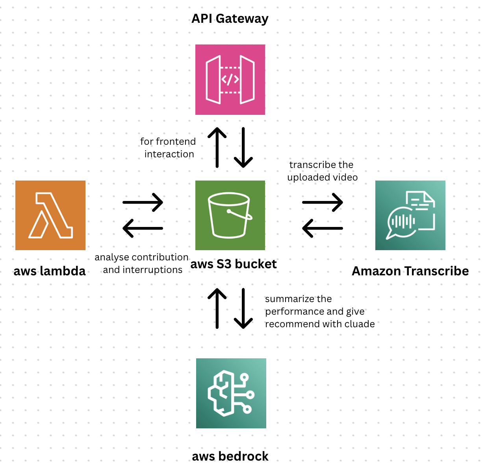

# 🎥 AWS Video Transcription & Summary Backend

This project is a serverless AWS backend pipeline that accepts **video uploads** and **transcript files** via API Gateway. It transcribes video content using Amazon Transcribe, analyzes the resulting transcript with a Lambda function, and generates a summary using an Amazon Bedrock agent. All outputs are stored in Amazon S3.

---

## 🧱 Tech Stack

- **API Gateway** – Entry point for uploading videos or transcript files via HTTP  
- **Amazon S3** – Storage for raw videos, transcript files (.vtt/.json), and analysis results  
- **AWS Lambda** – Orchestrates processing: parses transcripts, computes speaker stats, and triggers summarization  
- **Amazon Transcribe** – Converts speech in uploaded videos to text (.vtt or .json format)  
- **Amazon Bedrock (Claude/Anthropic Agent)** – Summarizes transcript content using a GenAI agent  
- **IAM Roles and Triggers** – Manages permissions and event-based processing  

---

## 🛠 Architecture Overview

## 🛠 Architecture Flow
API Gateway
    ↓
S3 Bucket (Video or Transcript Upload)
    ↓
[Event Trigger]
    ↓
Amazon Transcribe  ← (Only for video files)
    ↓
S3 Bucket (Transcripts)
    ↓
Lambda Function → Parses .vtt/.json, computes stats
    ↓
Amazon Bedrock AI → Summarizes and analyzes
    ↓
S3 Bucket (Final Output)
