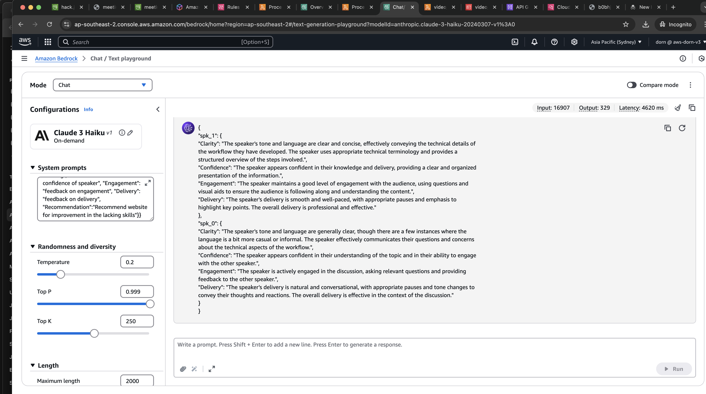

# 🎙️ EchoHer – Amplify Every Voice in Meetings

**EchoHer** is a post-meeting AI assistant that helps teams analyze participation dynamics, ensuring every voice is heard—not just the loudest.

---

## 🚨 Why It Matters

In many meetings, a few voices dominate while others are spoken over or ignored. This imbalance often disproportionately affects marginalized groups and women.

> 🧩 According to McKinsey’s 2024 Workplace Report, 39% of women report being frequently interrupted.

EchoHer addresses this by using AI to reveal speaking patterns, flag interruptions, and recommend ways to foster inclusive discussions.

---

## 🌟 What EchoHer Does

- 🗣️ Detects who spoke, for how long
- ❗ Identifies interruptions and calculates interruption share
- 📊 Flags conversational imbalance
- 🧠 Evaluates speakers on:
  - Clarity
  - Confidence
  - Engagement
  - Delivery
- 📬 Generates post-meeting reports with:
  - Performance feedback
  - Tailored improvement links

---

## 🛠️ How It Works

1. Upload an `.mp4` or `.vtt` meeting file to the cloud (via API Gateway or direct to S3)
2. Audio is transcribed using Amazon Transcribe
3. Transcripts are analyzed by a Lambda function
4. Speaker stats and imbalance metrics are computed
5. Summaries are generated using Amazon Bedrock (LLM)
6. Results are saved to S3 for retrieval or display

---

## ⚠️ Known Limitations

Due to time constraints during development:

- ❌ The **full LLM automation pipeline** (triggering Bedrock from Lambda and parsing model output) is not finalized
- ❌ The **frontend is not yet integrated** with the backend
- ✅ However, backend components work end-to-end, and analysis data is generated correctly in S3
- 📸 Below is a **placeholder mockup** from AWS Bedrock showing how results would look in the final UI:

### 🖼️ Backend Result Preview (Mockup Example)

> _Note: This is a static example to illustrate planned frontend integration using Bedrock-generated summaries._

---

## 🎬 Demo

### ▶️ Video Demo of Backend

Watch the EchoHer pipeline in action:

